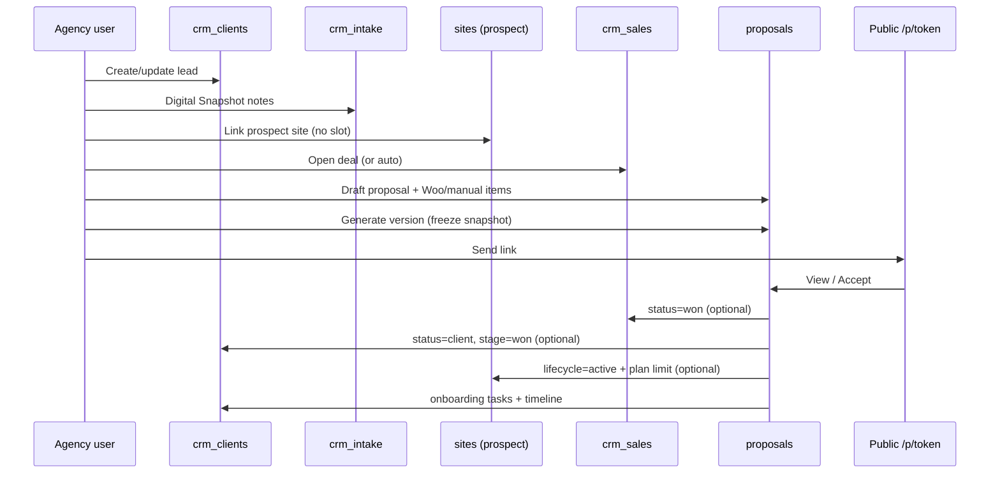

# Proposal System Architecture

**Status:** Phase 0–4 implemented (proposals through acceptance automation). Phase 5 hardening not started.  
**Date:** 2026-07-20 (updated 2026-07-24)  
**Scope:** Integrated proposals that extend CRM leads, Digital Snapshot, sites, WooCommerce, branding, and PDF — not a separate prospect database.

---

## 1. Current-state architecture summary

WebRankingReports is a Nuxt 3 + PocketBase monorepo. Multi-tenancy is **workspace-owner scoped**, not multi-row `agency` records:

| Layer | Reality in code |
|-------|-----------------|
| Auth / workspace | `getWorkspaceContext`, `requireCrmOwnerId`, `assertSiteAccess` in `apps/web/server/utils/workspace.ts`. Owners and members share CRM keyed by owner id; portal `client` role is blocked from CRM. |
| CRM contacts | `crm_clients` is the canonical org/contact (`status`: `lead` \| `client` \| `archived`). Optional `site` relation for onboarding. |
| Pipeline | `pipeline_stage` on `crm_clients`: `new` → `contacted` → `qualified` → **`proposal`** → `won` / `lost`. Kanban (`useCrmPipeline`) loads **leads only**. |
| “Proposals” today | UI label for **`crm_sales`** deals (title, amount, open/won/lost, optional `services_proposed` text). No document, line items, PDF, or acceptance flow. |
| Digital Snapshot | `crm_intake` — one row per client (`UNIQUE` on `client`). Manual notes fields + `website_url` / `snapshot_at`. Not an automated scan store. |
| Timeline | `crm_contact_points` (`call`, `email`, `meeting`, `note`, `report_sent`). Stage changes auto-log notes. |
| Tasks | `crm_tasks` per client; site To Dos are separate (`TodoTask`). |
| Sites | `sites` owned by workspace owner. Billing: `billing_status`, `trial_ends_at`, Stripe ids. **No prospect/active lifecycle field.** |
| Plan limits | `getUserUsage` counts **all** owner sites toward `max_sites` and **all** `crm_clients` toward `max_contacts`. |
| WooCommerce | Per-site integration; order aggregates only (`woocommerceAccess.ts`). **No product catalog sync.** |
| Branding | Per-owner `app_settings` key `agency_branding:{ownerId}` + singleton `agency` logo file. White-label gated by plan. |
| PDF | Playwright via `generateReportPdfBuffer` + short-lived in-memory `pdf_token` for report pages. Counts against monthly **reports** usage. |
| Onboarding | `/crm/onboarding` lists `status=client` rows + linked site integrations checklist — not a guided wizard. |

**Primary code anchors**

- Types: `apps/web/types/index.ts`
- CRM composables: `apps/web/composables/useCrm.ts`
- CRM APIs: `apps/web/server/api/crm/*`
- CRM pages: `apps/web/pages/crm/*`
- Schema docs/scripts: `docs/POCKETBASE_CRM_SCHEMA.md`, `apps/web/scripts/create-collections.mjs`, `update-crm-schema.mjs`
- Migrations: both `apps/pb/pb_migrations/` and `apps/pb_migrations/` (must stay in sync for CRM)

---

## 2. Data relationships (target)

```
users (workspace owner)
  └── crm_clients                    ← canonical contact (lead | client | archived)
        ├── crm_intake               ← Digital Snapshot notes (1:1)
        ├── crm_sales                ← opportunity / deal summary
        │     └── proposals          ← proposal document(s), versioned
        │           └── proposal_items ← frozen line items
        ├── crm_contact_points
        ├── crm_tasks
        └── site → sites             ← optional; may be lifecycle=prospect | active
              └── (scan caches / lighthouse / tech / limited research)

workspace owner sites
  └── one designated catalog site (WooCommerce connected)
        └── proposal_products        ← agency-scoped synced Woo catalog cache
```

**Lifecycle (product)**

```
CRM lead → Digital Snapshot → Proposal → Accepted
  → CRM client → Onboarding → Active reporting site
```

**Non-negotiables from requirements**

1. Do **not** invent a separate prospect/contact collection; keep using `crm_clients`.
2. `crm_sales` stays the deal summary; `proposals` / `proposal_items` hold documents and frozen lines.
3. Prospect sites link to leads but must **not** consume a normal active reporting slot.
4. Woo products come from the **selling agency’s catalog site**, never the prospect’s store.

---

## 3. Required schema changes

### Extend existing

| Collection | Change |
|------------|--------|
| `sites` | Add `lifecycle` (or `site_kind`): `prospect` \| `active` (default `active` for existing rows). Optionally `promoted_at`, `promoted_from_proposal`. |
| `crm_sales` | Add optional `proposal` (relation → latest/primary proposal) **or** derive via reverse relation; keep `services_proposed` as legacy free-text until UI migrates. |
| `crm_clients` | No status enum change. Optionally `prospect_site` alias is unnecessary if `site` is used for both prospect and active (preferred: single `site` field + site.lifecycle). |
| `crm_contact_points.kind` | Add proposal-related kinds (see §11). |
| `app_settings` / owner prefs | Optional key for `proposal_catalog_site_id` if not stored on a dedicated settings row. |
| Usage counting | `getUserUsage` must exclude `lifecycle = prospect` from `sites` count (and keyword sum for those sites unless intentionally limited). |

### Do not create

- A `prospects` / `crm_prospects` collection mirroring contacts.
- A second contact store for pre-sales.

### Soft-deprecate (keep data, stop treating as the proposal UX)

| Artifact | Action |
|----------|--------|
| UI label “Proposals” on `crm_sales` | Rename to **Deals** / **Opportunities**; reserve “Proposal” for document entities. |
| `crm_sales.services_proposed` | Keep for back-compat; prefer `proposal_items` for new flows. |
| `/crm/deals` orphan page | Either wire into nav as Deals or fold into proposals hub. |

---

## 4. Extend vs deprecate existing collections

| Collection | Verdict |
|------------|---------|
| `crm_clients` | **Keep / extend** — canonical contact. |
| `crm_sales` | **Keep** as deal summary; link to proposals. Do not overload with line items or PDF blobs. |
| `crm_intake` | **Keep** for human Digital Snapshot notes; proposal freeze copies structured scan JSON separately (see §14). |
| `crm_tasks` | **Keep**; acceptance may create onboarding tasks here. |
| `crm_contact_points` | **Keep**; extend kinds. |
| `sites` | **Extend** with lifecycle; do not fork a `prospect_sites` collection. |
| `integrations` / Woo | **Reuse** for catalog site credentials; add product sync + cache collection. |
| `agency` | **Leave as logo singleton**; branding continues via `app_settings`. |
| `seoptimer_leads` | Unrelated inbound inbox; convert still creates `crm_clients` leads. |

---

## 5. New PocketBase collections and fields

### 5.1 `proposals`

| Field | Type | Notes |
|-------|------|-------|
| `user` | relation → users | Workspace owner (same CRM ownership pattern) |
| `client` | relation → crm_clients | Required |
| `sale` | relation → crm_sales | Required (or create sale on first proposal) |
| `site` | relation → sites | Prospect (or active) site whose scan data was used |
| `version` | number | Monotonic per sale or per client+sale |
| `status` | select | `draft` \| `sent` \| `viewed` \| `accepted` \| `declined` \| `superseded` \| `expired` |
| `title` | text | |
| `intro_html` / `terms_html` | text or editor JSON | Agency copy |
| `currency` | text | e.g. `USD` |
| `subtotal` / `total` | number | Denormalized from items |
| `valid_until` | date | Optional |
| `snapshot_json` | json | **Frozen** pre-sales scan + intake excerpt at generate time |
| `branding_json` | json | Frozen colors/name/logo URL snapshot for reproducibility |
| `public_token` | text | Unique share token (hashed or raw UUID; prefer hashed) |
| `sent_at` / `viewed_at` / `accepted_at` / `declined_at` | date | |
| `accepted_by_name` / `accepted_by_email` | text | Capture on accept |
| `acceptance_options_json` | json | Which side-effects to run (won deal, promote site, etc.) |
| `pdf_filename` | text | Optional cached last export name |

Indexes: `user`, `client`, `sale`, unique `(sale, version)`, unique `public_token` (if stored plaintext).

### 5.2 `proposal_items`

| Field | Type | Notes |
|-------|------|-------|
| `user` | relation → users | |
| `proposal` | relation → proposals | Cascade delete |
| `sort_order` | number | |
| `source` | select | `woo` \| `manual` \| `package` |
| `product` | relation → proposal_products | Optional (null if manual) |
| `external_product_id` | text | Woo product id at sync time |
| `sku` | text | Frozen |
| `name` | text | Frozen |
| `description` | text | Frozen |
| `qty` | number | |
| `unit_price` | number | Frozen |
| `billing_interval` | select | `one_time` \| `month` \| `year` \| `custom` |
| `metadata_json` | json | Optional Woo attributes |

### 5.3 `proposal_products` (agency catalog cache)

| Field | Type | Notes |
|-------|------|-------|
| `user` | relation → users | Agency/workspace owner |
| `catalog_site` | relation → sites | Site that owns Woo credentials |
| `external_id` | text | Woo product id |
| `sku` | text | |
| `name` | text | |
| `description` | text | |
| `price` | number | |
| `regular_price` / `sale_price` | number | Optional |
| `currency` | text | |
| `status` | select | `publish` \| `draft` \| `archived` (local) |
| `woo_status` | text | Raw Woo status |
| `image_url` | text | |
| `permalink` | text | |
| `raw_json` | json | Last sync payload (trim PII) |
| `synced_at` | date | |

Unique index: `(user, catalog_site, external_id)`.

### 5.4 Optional: `proposal_events` or reuse timeline only

Prefer logging to `crm_contact_points` for CRM visibility; use `proposals` status timestamps for funnel analytics. Add `proposal_events` only if audit detail exceeds timeline capacity.

### 5.5 Site field additions

```
lifecycle: prospect | active   (default active)
# optional:
is_reporting_slot: bool        # derived: active → true; prospect → false
```

Prefer computing “counts toward plan” from `lifecycle === 'active'` rather than a second flag that can drift.

### 5.6 Catalog site designation

Store on owner settings (recommended):

- `app_settings` key `proposal_settings:{ownerId}` → `{ catalog_site_id: string }`

Alternatively a boolean `sites.is_proposal_catalog` with uniqueness enforced in API (only one per owner).

---

## 6. PocketBase API rules

Match existing CRM pattern:

```
listRule / viewRule / updateRule / deleteRule: user = @request.auth.id
createRule: @request.auth.id != ""
```

**Important:** Real multi-member access today goes through Nitro + **admin PB** + `requireCrmOwnerId` / `crmRowOwnedByUser`. Direct client SDK access by members would fail owner-keyed rules. **Keep all proposal mutations on server APIs** (same as CRM).

### Public proposal access

Do **not** open list/view rules for anonymous users on `proposals`.

- Public read: Nuxt route `/p/[token]` → server API validates token → admin PB fetch → return sanitized DTO (no internal notes, no other clients).
- Accept: `POST /api/proposals/public/[token]/accept` with rate limits + optional CAPTCHA later.

### Recommendations

- Store `public_token_hash` + random token shown once, or opaque UUID with constant-time lookup via indexed field used only server-side.
- Empty create/list rules for `proposal_products` if sync is admin-only; or same `user = @request.auth.id` pattern.

---

## 7. TypeScript interfaces

Add to `apps/web/types/index.ts` (sketch):

```ts
export type SiteLifecycle = 'prospect' | 'active'

export type ProposalStatus =
  | 'draft' | 'sent' | 'viewed' | 'accepted' | 'declined' | 'superseded' | 'expired'

export type ProposalItemSource = 'woo' | 'manual' | 'package'

export interface ProposalSnapshot {
  captured_at: string
  website_url?: string
  intake?: Partial<CrmIntake>
  lighthouse?: Record<string, unknown> | null
  tech?: Record<string, unknown> | null
  seo_basic?: Record<string, unknown> | null
  keywords_limited?: Record<string, unknown> | null
}

export interface Proposal {
  id: string
  user: string
  client: string
  sale: string
  site?: string | null
  version: number
  status: ProposalStatus
  title: string
  intro_html?: string | null
  terms_html?: string | null
  currency: string
  subtotal?: number | null
  total?: number | null
  valid_until?: string | null
  snapshot_json?: ProposalSnapshot | null
  branding_json?: Record<string, unknown> | null
  sent_at?: string | null
  viewed_at?: string | null
  accepted_at?: string | null
  declined_at?: string | null
  accepted_by_name?: string | null
  accepted_by_email?: string | null
  acceptance_options_json?: ProposalAcceptanceOptions | null
  created: string
  updated: string
  expand?: { client?: CrmClient; sale?: CrmSale; site?: Site; items?: ProposalItem[] }
}

export interface ProposalItem {
  id: string
  user: string
  proposal: string
  sort_order: number
  source: ProposalItemSource
  product?: string | null
  external_product_id?: string | null
  sku?: string | null
  name: string
  description?: string | null
  qty: number
  unit_price: number
  billing_interval?: 'one_time' | 'month' | 'year' | 'custom' | null
  metadata_json?: Record<string, unknown> | null
}

export interface ProposalProduct {
  id: string
  user: string
  catalog_site: string
  external_id: string
  sku?: string | null
  name: string
  description?: string | null
  price: number
  currency?: string | null
  status: 'publish' | 'draft' | 'archived'
  image_url?: string | null
  synced_at?: string | null
}

export interface ProposalAcceptanceOptions {
  mark_deal_won?: boolean
  convert_lead_to_client?: boolean
  promote_site_to_active?: boolean
  create_onboarding_tasks?: boolean
  log_activity?: boolean
  set_pipeline_stage_won?: boolean
}

// Also extend:
// Site.lifecycle?: SiteLifecycle
// CrmSale.services_proposed?: string | null  (already in PB; missing in TS today)
// CrmContactPoint.kind += proposal_* kinds
```

Zod schemas: mirror in `apps/web/lib/crmSchemas.ts` or new `proposalSchemas.ts`.

---

## 8. Server API routes

All authenticated routes: Bearer → `getUserIdFromRequest` → admin PB → `requireCrmOwnerId` → ownership checks.

### Authenticated (agency)

| Method | Path | Purpose |
|--------|------|---------|
| GET | `/api/crm/proposals` | List (`client`, `sale`, `status` filters) |
| POST | `/api/crm/proposals` | Create draft (optionally create/link `crm_sales`) |
| GET | `/api/crm/proposals/:id` | Detail + items + snapshot |
| PATCH | `/api/crm/proposals/:id` | Edit draft fields / items (block if not draft) |
| POST | `/api/crm/proposals/:id/items` | Replace or upsert items (draft only) |
| POST | `/api/crm/proposals/:id/generate-version` | Freeze snapshot + bump version / supersede prior sent |
| POST | `/api/crm/proposals/:id/send` | Mark sent, ensure token, optional email later |
| POST | `/api/crm/proposals/:id/pdf` | Playwright PDF (proposal template; **do not** burn report quota by default) |
| POST | `/api/crm/proposals/:id/accept` | Internal accept (agency on behalf of client) |
| POST | `/api/crm/proposals/:id/decline` | |
| GET/POST | `/api/crm/proposal-products` | List / trigger sync |
| POST | `/api/crm/proposal-products/sync` | Sync from catalog site Woo |
| GET/PATCH | `/api/crm/proposal-settings` | Catalog site id |
| POST | `/api/workspace/sites` | Extend: allow `lifecycle: 'prospect'` **without** `assertPlanLimit(..., 'sites')` (or separate soft cap) |
| POST | `/api/crm/sites/promote` | Promote prospect → active (then assert plan limit) |

### Public

| Method | Path | Purpose |
|--------|------|---------|
| GET | `/api/proposals/public/:token` | Sanitized proposal + items + branding + frozen snapshot |
| POST | `/api/proposals/public/:token/view` | Idempotent viewed_at |
| POST | `/api/proposals/public/:token/accept` | Accept + run options |
| POST | `/api/proposals/public/:token/decline` | |

### Prospect pre-sales scans (authenticated)

Thin wrappers that allow tools when `site.lifecycle === 'prospect'` even if billing-locked:

| Method | Path | Notes |
|--------|------|-------|
| POST | `/api/crm/prospect-scans/lighthouse` | Scoped, rate-limited |
| GET | `/api/crm/prospect-scans/tech` | |
| POST | `/api/crm/prospect-scans/seo-basic` | Subset of site-audit or lighter checks |
| POST | `/api/crm/prospect-scans/keywords` | Hard cap (e.g. 5 keywords), separate from rank_keywords quota or counted carefully |

---

## 9. Nuxt routes and pages

| Route | Role |
|-------|------|
| `/crm/clients/[id]` | Add **Proposals** tab for documents (rename current sales tab to **Deals**). Link intake → “Create proposal”. |
| `/crm/proposals` | Hub: drafts/sent/accepted across clients |
| `/crm/proposals/[id]` | Builder: items from catalog, snapshot panel, preview, send, PDF |
| `/crm/proposals/settings` | Catalog site + sync controls (owner) |
| `/crm/pipeline` | When moving to stage `proposal`, CTA to create/open proposal |
| `/crm/onboarding` | After accept + convert, row appears when `status=client` |
| `/p/[token]` | Public proposal view (minimal chrome, agency branding) |
| `/p/[token]/pdf` | Optional print-ready layout for Playwright |

Middleware: existing auth for CRM routes; public `/p/*` unauthenticated.

---

## 10. Reusable components

| Component | Responsibility |
|-----------|----------------|
| `CrmProposalList` | Table/cards of proposals for a client or global hub |
| `ProposalBuilderForm` | Title, intro, terms, validity |
| `ProposalItemEditor` | Add from `proposal_products` or manual line |
| `ProposalSnapshotPanel` | Show frozen vs live Digital Snapshot / scans |
| `ProposalStatusBadge` | Status chips consistent with CRM |
| `ProposalPublicView` | Shared by `/p/[token]` and PDF route |
| `ProposalAcceptPanel` | Name/email + optional checkboxes mirroring acceptance options (agency-configured defaults) |
| Extend `CrmSubNav` | Add Proposals; fix Deals nav inconsistency |

Reuse: `CrmModal`, intake form patterns on `clients/[id].vue`, `useAgencyReportBranding` CSS vars for public/PDF surfaces.

---

## 11. CRM timeline events

Extend `CrmContactPoint.kind` (migration + types + UI filters):

| Kind | When |
|------|------|
| `proposal_created` | Draft created |
| `proposal_sent` | Sent / link shared |
| `proposal_viewed` | First public view (dedupe) |
| `proposal_accepted` | Accept |
| `proposal_declined` | Decline |
| `proposal_superseded` | New version replaces prior |

Keep using `note` for free-form; continue auto-notes for pipeline stage changes. On accept, summary should mention deal/site side-effects performed.

---

## 12. WooCommerce product-sync design

**Source of truth:** WooCommerce REST `/products` on the **catalog site** (`getWooCommerceConfig(pb, catalogSiteId)` + new `wcGet('/products', …)`).

**Not** the prospect site. Prospect may not even have Woo.

**Flow**

1. Owner selects catalog site (must have Woo `connected` + keys).
2. `POST /api/crm/proposal-products/sync`:
   - Paginate Woo products (`per_page=100`).
   - Upsert `proposal_products` by `(user, catalog_site, external_id)`.
   - Soft-archive local rows missing from Woo (or mark `woo_status`).
3. Proposal builder only lists `status=publish` (or filterable).
4. Adding a line **copies** name/price/description into `proposal_items` (freeze at add time; re-freeze all on `generate-version`).

**Conflicts / gaps today**

- `wcGet` exists but only orders are used.
- No products collection.
- Top products in reports come from order line items — unrelated to catalog.

**Security:** Never expose Woo keys to the browser; sync server-side only.

---

## 13. Prospect-site lifecycle

### Create

- From lead detail: “Attach prospect site” → `POST /api/workspace/sites` with `lifecycle: 'prospect'`, domain from intake `website_url` or lead fields.
- Link `crm_clients.site = newSiteId`.
- **Skip** `assertPlanLimit(..., 'sites')` for prospect creates.
- **Skip** starting a billable Stripe trial that locks tooling, **or** set `billing_status` such that `isSiteBillingLocked` is false for prospects (dedicated branch in `siteBilling.ts`).

### Allowed pre-sales work

- Lighthouse, basic SEO, tech detection, limited keyword research (requirement §5).
- Digital Snapshot notes on `crm_intake`.
- **Disallow** (or soft-gate): full rank tracking volume, weekly cron reporting, client portal access, treating as onboarding customer.

### Promote (on accept or manual)

1. `assertPlanLimit(..., 'sites', 1)` for converting to active slot.
2. Set `lifecycle = 'active'`, start trial / billing as today’s `sites.post` does.
3. Optionally keep same site id (preferred — preserves scan history) rather than cloning.

### Counting

Update `getUserUsage` filter to:

```
user = "{owner}" && lifecycle != "prospect"
```

(Treat missing `lifecycle` as `active` for backward compatibility.)

---

## 14. Proposal-version strategy

**Recommended model:** immutable published versions.

1. **Draft** editable; items mutable; snapshot optional/live preview.
2. **Generate / Send** creates a frozen version:
   - Increment `version`.
   - Copy current items into this version’s `proposal_items` (or clone proposal row).
   - Write `snapshot_json` from intake + prospect scans at that moment.
   - Freeze `branding_json`.
   - Prior `sent` version → `superseded` (same `sale`).
3. Edits after send require **new version** (new proposal row or version bump with new item set).

**Alternative (simpler MVP):** one proposal row per deal; `version` integer; on regenerate, archive items to history JSON. Prefer discrete rows for PDF auditability.

**Relation to Digital Snapshot:** `crm_intake` remains live/editable; proposal stores a **copy** in `snapshot_json` so later intake edits do not rewrite sent proposals.

---

## 15. Proposal acceptance workflow

`POST .../accept` (public or agency) with `ProposalAcceptanceOptions` (defaults configured per agency):

| Option | Implementation |
|--------|----------------|
| Mark deal won | `crm_sales.status = won`, `closed_at = now`, amount from proposal total if empty |
| Pipeline won | `crm_clients.pipeline_stage = won` |
| Lead → client | `crm_clients.status = client` (removes from Kanban) |
| Promote site | `sites.lifecycle = active` + plan limit + billing trial start |
| Onboarding tasks | Create `crm_tasks` templates (e.g. Connect GA, GSC, confirm billing) |
| Log activity | `crm_contact_points` `proposal_accepted` |

Idempotency: if already `accepted`, return success without re-running side-effects (store `acceptance_run_id` / flag).

**Explicit conflict today:** winning a deal or stage does **not** convert lead→client. Acceptance must make this optional and explicit so behavior is intentional.

---

## 16. PDF / public proposal strategy

### Public page

- `/p/[token]` renders `ProposalPublicView` with frozen branding CSS variables (same spirit as `useAgencyReportBranding`).
- No auth; token is capability URL. Rotate token on demand; expire via `valid_until` / status.

### PDF

- Reuse Playwright pattern from `reportPdf.ts`, but:
  - Render `/p/{token}/pdf` or authenticated `/crm/proposals/{id}/print`.
  - **Do not** call `incrementUsage(..., 'reports')` for proposal PDFs (or add separate `proposals` limit later).
  - Respect white-label flags similarly (`force_wrr_branding` / `disable_white_label`).

### Token infra conflict

`pdfToken.ts` is **in-memory** and 5-minute TTL — fine for short Playwright jobs, **not** for long-lived public proposal links. Proposal tokens must be **persisted** on the proposal record (or Redis later), not the in-memory PDF map.

---

## 17. Security risks

| Risk | Mitigation |
|------|------------|
| Public token leakage | Unpredictable tokens; HTTPS only; allow revoke/regenerate; no PII beyond proposal content; rate-limit accept/view |
| IDOR across workspaces | Always scope by `user = crmOwnerId`; verify `client`/`sale`/`site` ownership on every write |
| Member vs owner PB rules | Keep admin-SDK server path; never rely on client-side PB for proposals |
| Woo key exfiltration | Server-only sync; never return secrets in product DTOs |
| Prospect sites bypassing plan limits | Soft cap on prospects (e.g. max 20) to prevent abuse; still exclude from `max_sites` |
| Pre-sales scans on locked sites | Explicit allowlist for prospect lifecycle only; keep Growth+ gates where product requires |
| Snapshot over-collection | Freeze only intended public fields; strip `internal_note` from public DTO |
| Accept race | Transactional-ish sequential updates + idempotent accept |
| Portal clients | Continue blocking CRM; public accept is not portal login |
| Dual migration trees | Ship identical migrations to `apps/pb/pb_migrations` and `apps/pb_migrations` to avoid env drift |

---

## 18. Migration order

1. **Sites:** add `lifecycle` (default/backfill `active`).
2. **Usage + billing helpers:** exclude prospects from `getUserUsage`; prospect bypass in `isSiteBillingLocked` / create path.
3. **`proposal_products`** collection + settings key for catalog site.
4. **`proposals`** collection.
5. **`proposal_items`** collection.
6. **`crm_contact_points.kind`** values extended.
7. Optional: `crm_sales.proposal` relation (or skip and query by `sale`).
8. Bootstrap scripts: update `create-collections.mjs` / CRM scripts to match migrations.
9. Data backfill: none required for proposals; existing “Proposals” UI rename only.

Deploy code that tolerates missing new collections until migrations run (feature flag optional).

---

## 19. Testing plan

### Unit / service

- `getUserUsage` ignores `lifecycle=prospect`.
- Prospect site create does not throw `PLAN_LIMIT_REACHED` when at max active sites.
- Promote-to-active throws when over limit.
- Snapshot freeze excludes `internal_note` from public DTO.
- Version supersede marks prior `sent` as `superseded`.
- Accept idempotency.
- Woo product upsert uniqueness.

### API integration (local PB)

- CRM owner/member can CRUD proposals; portal client 403.
- Cross-owner token/id access 404/403.
- Public GET by token works; wrong token 404.
- Accept options matrix (each flag on/off).

### UI / smoke

- Lead → intake → create proposal → add Woo lines → generate → public link → accept → client appears on onboarding → site is active and counts toward limit.
- PDF download branded for white-label plan; WRR forced branding on free.

### Regression

- Existing report PDF + monthly report quota unchanged.
- Active site Lighthouse/cron still skip billing-locked actives.
- Kanban still lead-only; accepted+converted leaves pipeline.

---

## 20. Phased implementation plan

### Phase 0 — Alignment (no schema)

- Rename UI “Proposals” (`crm_sales`) → **Deals**.
- Document catalog-site requirement for agencies using Woo line items.
- Agree acceptance defaults.

### Phase 1 — Foundation

- `sites.lifecycle` + usage/billing exclusions.
- Prospect site create/link from CRM lead.
- Types + empty collections `proposals` / `proposal_items`.
- Draft proposal CRUD + manual line items only.
- Timeline kinds + client detail tab.

### Phase 2 — Snapshot freeze + public link

- Capture intake + optional scans into `snapshot_json`.
- Versioning / send / public `/p/[token]`.
- PDF export (Playwright) without report quota.
- Pipeline CTA at stage `proposal`.

### Phase 3 — Woo catalog

- Catalog site setting + product sync + builder picker.
- Frozen `proposal_items` from catalog.

### Phase 4 — Acceptance automation

- Accept workflow options (won, convert, promote, tasks, activity).
- Onboarding handoff verification.

### Phase 5 — Hardening

- Prospect soft caps, rate limits, token revoke, audit events.
- Email “send proposal” (reuse email campaign infra carefully).
- Feature flag + plan gating if needed (`max_proposals` later).

---

## Conflicts with the existing codebase (explicit)

| # | Conflict | Detail | Resolution direction |
|---|----------|--------|----------------------|
| 1 | **Naming collision** | UI and `/crm/deals` call `crm_sales` “Proposals”; pipeline stage is also `proposal`. | Rename deal UI to Deals; keep stage enum; new `proposals` collection for documents. |
| 2 | **No prospect sites** | Every site counts in `getUserUsage` and gets trial/billing lock semantics. | Add `lifecycle`; exclude prospects from site quota; special-case billing lock for prospects. |
| 3 | **Tools require non-locked sites** | Lighthouse, tech detection, site-audit, research use ownership + `isSiteBillingLocked`. | Allowlisted prospect-scan APIs or billing bypass for `lifecycle=prospect`. |
| 4 | **Woo is orders-only** | No `/products` sync or local catalog. | New sync + `proposal_products`; catalog site ≠ prospect site. |
| 5 | **Digital Snapshot ≠ automated scan** | `crm_intake` is manual notes; freeze requirement needs structured scan JSON. | Keep intake; add `proposals.snapshot_json` for frozen bundle. |
| 6 | **No accept → client automation** | Status changes are manual; won stage/deal does not convert. | Optional acceptance side-effects; do not silently change historical behavior for deals alone. |
| 7 | **Onboarding ≠ wizard** | `/crm/onboarding` is an integrations checklist for `status=client`. | Reuse as post-accept destination; task templates fill the “create onboarding tasks” gap. |
| 8 | **PDF token model** | In-memory 5-minute tokens for reports. | Persist proposal public tokens; separate PDF generation path. |
| 9 | **Report quota coupling** | Report PDFs increment monthly reports usage. | Proposal PDFs must not share that counter by default. |
| 10 | **Type drift** | `CrmSale` omits `services_proposed` present in PB/API. | Fix types when touching sales; prefer items over free text. |
| 11 | **Agency collection misconception** | `agency` is logo singleton; multi-agency is workspace-owner branding. | Scope proposals by CRM owner/`user`; branding from `app_settings`. |
| 12 | **Dual migration directories** | `apps/pb/pb_migrations` and `apps/pb_migrations` both hold CRM migrations. | Duplicate new migrations in both (or consolidate as a prerequisite). |
| 13 | **Bootstrap script drift** | `create-collections.mjs` / `create-crm-collections.mjs` can lag migrations. | Update scripts in same PR as migrations. |
| 14 | **Single `crm_clients.site`** | One site relation; prospect then promote must reuse same link. | Prefer promote-in-place over a second site relation. |
| 15 | **Growth+ middleware** | Some tools gated by `site-tools-plan.global.ts`. | Decide whether prospect scans inherit Growth+ or allow limited scans on lower plans for pre-sales. |
| 16 | **Composable coverage** | `useCrm.ts` has no intake/proposal helpers; pages `$fetch` directly. | Add `useCrmProposals()` following existing patterns. |
| 17 | **Nav inconsistency** | `CrmSubNav` omits Deals; proposals hub does not exist. | Add Proposals; clarify Deals entry. |

---

## Recommended decision defaults (for implementation kickoff)

1. **One site relation** on the client; lifecycle flips prospect → active.
2. **`crm_sales` required** parent for each proposal (auto-create open deal titled from proposal if missing).
3. **Immutable sent versions** as separate proposal rows (or strict version + item clone).
4. **Public proposals** via persisted token; no PB public rules.
5. **Acceptance defaults:** mark deal won + pipeline won + convert to client + promote site + log activity + create 3–5 onboarding tasks; all toggleable.
6. **Catalog:** exactly one catalog site per workspace owner.

---

## Out of scope (initially)

- E-sign / DocuSign.
- Stripe Checkout from proposal line items (can follow later using frozen prices).
- Multi-currency FX.
- Client portal proposal inbox (public link is enough).
- Replacing SEOptimer inbound flow.

---

## Appendix A — Key file map

| Concern | Path |
|---------|------|
| CRM types | `apps/web/types/index.ts` |
| CRM composables | `apps/web/composables/useCrm.ts` |
| Client detail / deals UI | `apps/web/pages/crm/clients/[id].vue` |
| Pipeline | `apps/web/pages/crm/pipeline.vue`, `utils/crmPipelineStage.ts` |
| Intake APIs | `apps/web/server/api/crm/intake*.ts` |
| Sales APIs | `apps/web/server/api/crm/sales*.ts` |
| Onboarding | `apps/web/server/api/crm/onboarding.get.ts`, `pages/crm/onboarding.vue` |
| Workspace / CRM owner | `apps/web/server/utils/workspace.ts` |
| Plan limits | `apps/web/server/services/subscriptions.ts` |
| Site billing lock | `apps/web/server/utils/siteBilling.ts` |
| Site create | `apps/web/server/api/workspace/sites.post.ts` |
| Woo | `apps/web/server/utils/woocommerceAccess.ts`, `server/api/woocommerce/*` |
| Branding | `apps/web/server/utils/branding.ts`, `composables/useAgencyReportBranding.ts` |
| Report PDF | `apps/web/server/utils/reportPdf.ts`, `pdfToken.ts` |
| CRM schema notes | `docs/POCKETBASE_CRM_SCHEMA.md` |

---

## Appendix B — Lifecycle sequence (target)



---

*End of design document. No migrations or production code were written as part of this plan.*
